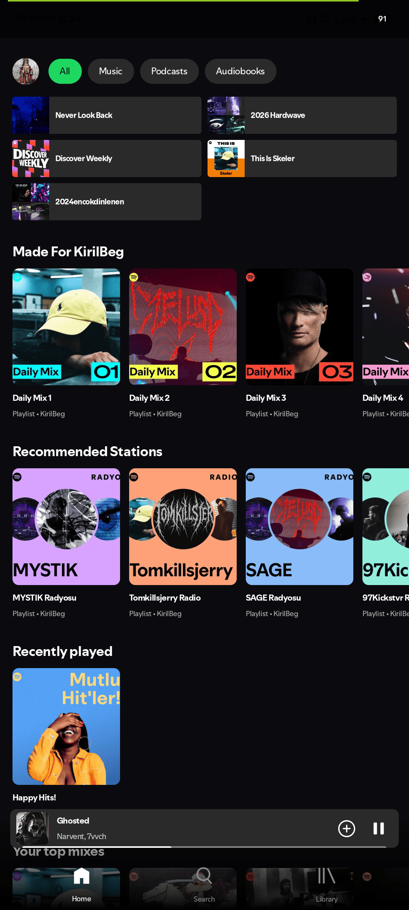
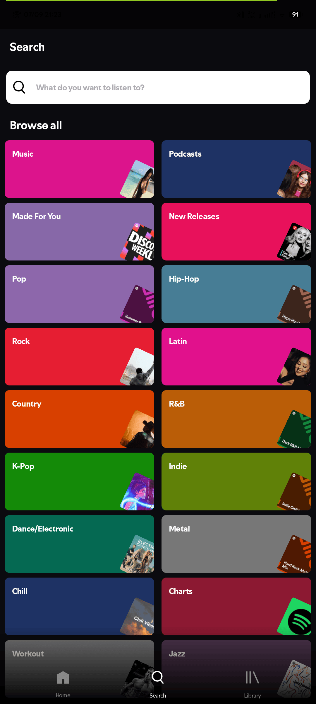
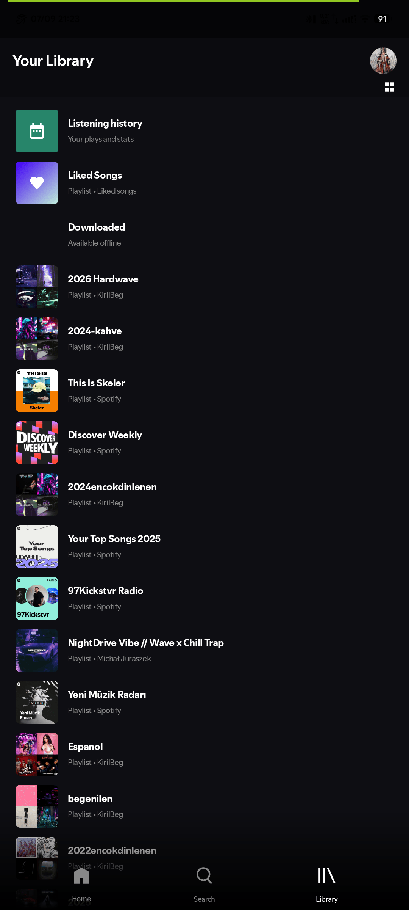
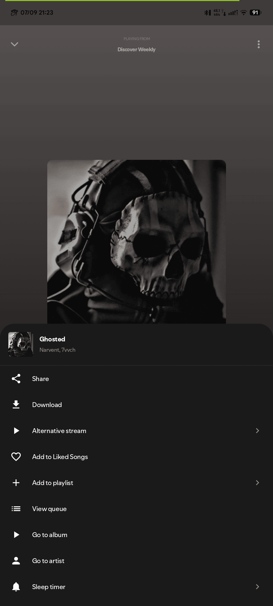
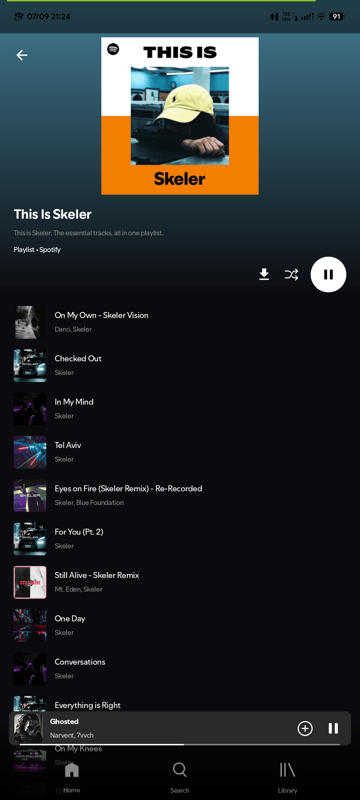
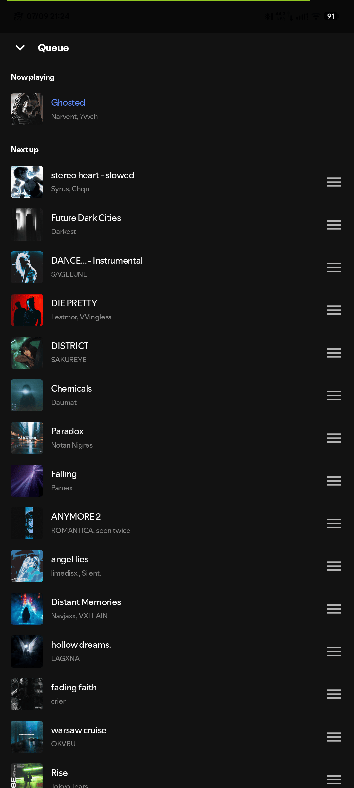
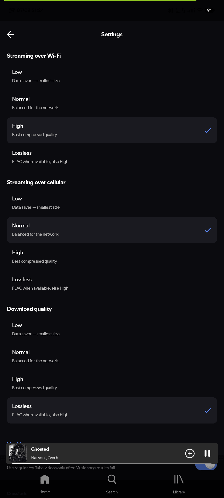
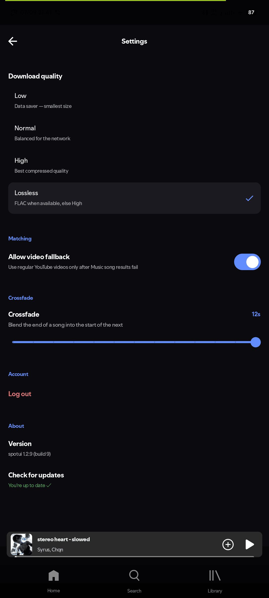

<div align="center">

  

  <h1>Spotufi</h1>

  <p align="center">
    <strong>Multi-source Android music player with lossless FLAC, YouTube matching, and Spotify sync.</strong>
    <br />
    <em>Connect your real Spotify account. Lossless FLAC via public TIDAL backends, YouTube audio matching, offline downloads, crossfade, and DJ mixing.</em>
  </p>

  <p align="center">
    <a href="#features"><b>Features</b></a> •
    <a href="#screenshots"><b>Screenshots</b></a> •
    <a href="#download"><b>Download</b></a> •
    <a href="#build-from-source"><b>Build</b></a> •
    <a href="#architecture"><b>Architecture</b></a> •
    <a href="#credits"><b>Credits</b></a> •
    <a href="#license"><b>License</b></a>
  </p>

  <div align="center">
    
    
    
    
    
    
    
    
    
  </div>

</div>

<hr />

**Spotufi** is a multi-source Android music player that combines Spotify syncing, lossless FLAC streaming (TIDAL monochrome DASH), and YouTube audio matching into one app. Play without a Spotify account, download for offline, export to MP3/FLAC, and enjoy DJ-style crossfade with tri-state repeat.

---

## Features

<div align="center">

<table>
  <tr>
    <td width="50%" valign="top">
      <div align="left">
        <h3>Playback</h3>
        <ul>
          <li>Connect with your real Spotify account</li>
          <li>Full playlist, album, and artist playback</li>
          <li>Queue management with drag-to-reorder</li>
          <li>Swipe-to-queue — swipe right on any song to add to queue</li>
          <li>Batch queueing — add entire playlists/albums to queue at once</li>
          <li>Session restore — queue and playback position saved across restarts</li>
          <li>Sleep timer with precise control</li>
          <li>Spotify radio / autoplay — queue continues with real recommendations</li>
          <li>Spotify Web Player fallback (hidden WebView, episodes support)</li>
          <li>Mini player with album-art powered colors</li>
          <li>Slide-to-dismiss player gesture</li>
          <li>Tri-state repeat: Off, One, All</li>
        </ul>
      </div>
    </td>
    <td width="50%" valign="top">
      <div align="left">
        <h3>Audio Quality</h3>
        <ul>
          <li>4-tier quality: Low, Normal, High, Lossless</li>
          <li>Separate quality settings for Wi-Fi, cellular, and downloads</li>
          <li>Lossless FLAC streaming via Tidal/Qobuz/Amazon</li>
          <li>Crossfade between tracks (0–12 seconds)</li>
          <li>DJ-style mixing — real LPF/HPF frequency sweep</li>
          <li>Gapless playback via Media3 ExoPlayer</li>
          <li>Preloading for instant track switching</li>
          <li>Stream URL caching — skips re-resolution for repeated plays</li>
          <li>Persistent YouTube video candidate cache</li>
        </ul>
      </div>
    </td>
  </tr>
  <tr>
    <td width="50%" valign="top">
      <div align="left">
        <h3>Lyrics</h3>
        <ul>
          <li>Synced lyrics — Spotify's own color-lyrics</li>
          <li>Full-screen lyrics view with auto-scroll</li>
          <li>Tap any line to seek to that position</li>
          <li>Fallback to LRCLIB for community-sourced lyrics</li>
          <li>Background prefetch — lyrics ready before you ask</li>
          <li>Persistent lyrics cache — cached on first fetch</li>
        </ul>
      </div>
    </td>
    <td width="50%" valign="top">
      <div align="left">
        <h3>Library &amp; Sync</h3>
        <ul>
          <li>Full Spotify library — playlists, liked songs, saved albums</li>
          <li>Create playlists and sync with your Spotify account</li>
          <li>Real-time sync — likes, follows, playlist changes reflect on Spotify</li>
          <li>Grid or list view for your library</li>
          <li>Downloaded tracks for offline playback</li>
          <li>Download search and sort (date, title, artist)</li>
          <li>Automatic export to configurable Music/ folder</li>
          <li>Configurable download folder name (Settings → Updates)</li>
          <li>Clear all downloads with confirmation</li>
          <li>Offline access — works without login</li>
          <li>Local listening history with stats, top artists, top tracks</li>
          <li>Interactive playback from history</li>
        </ul>
      </div>
    </td>
  </tr>
  <tr>
    <td width="50%" valign="top">
      <div align="left">
        <h3>Discovery</h3>
        <ul>
          <li>Personalized home feed from Spotify</li>
          <li>Search tracks, albums, artists, and podcasts</li>
          <li>Browse genre categories with curated playlists</li>
          <li>Full artist pages — Jsoup-parsed biography with clickable links, discography, related artists</li>
          <li>Verified artist badge on artist pages</li>
          <li>Smart recommendation engine with taste profiling</li>
          <li>Spotify Canvas video backgrounds</li>
        </ul>
      </div>
    </td>
    <td width="50%" valign="top">
      <div align="left">
        <h3>Interface</h3>
        <ul>
          <li>Material 3 design language</li>
          <li>Album-art powered dynamic colors</li>
          <li>Clean navigation — Home, Search, Library</li>
          <li>Bottom sheet actions for every track</li>
          <li>Alternative stream override (local files or YouTube URLs)</li>
          <li>Android Auto support</li>
          <li>Battery optimization bypass for background playback</li>
          <li>Configurable update source with markdown release notes</li>
          <li>Notification close button</li>
        </ul>
      </div>
    </td>
  </tr>
</table>

</div>

---

## Screenshots

<div align="center">











</div>

---

## Download

<div align="center">

<table>
  <thead>
    <tr>
      <th align="center">Obtainium</th>
      <th align="center">GitHub</th>
    </tr>
  </thead>
  <tbody>
    <tr>
      <td align="center">
        <a href="https://apps.obtainium.imranr.dev/redirect?r=obtainium://add/https://github.com/fr0stb1rd/Spotufi/">
          
        </a>
      </td>
      <td align="center">
        <a href="https://github.com/fr0stb1rd/spotufi/releases/latest">
          
        </a>
      </td>
    </tr>
  </tbody>
</table>

</div>

> **Notes:** The trusted download source is listed above; we are not responsible for any risks you may encounter from downloading from other sources. Spotufi requires **Android 8.0 (API 26)** or higher.

---

## Build from Source

```bash
# Prerequisites: JDK 21 LTS, Android SDK 37
git clone https://github.com/fr0stb1rd/Spotufi.git
cd Spotufi
./gradlew assembleDebug
```

Debug APKs are output to `app/build/outputs/apk/debug/` (one per ABI + universal).

---

## Architecture

Spotufi is built on a clean MVVM architecture with Jetpack Compose. All song lists are deduplicated at the data layer to prevent LazyColumn key collisions (see Data Integrity below).

| Layer | Technology |
|---|---|
| **UI** | Jetpack Compose + Material 3 (Compose BOM 2026.06.01 → Material3 1.4.0) |
| **Navigation** | Navigation Compose (16 routes) |
| **DI** | Hilt |
| **Playback** | Media3 ExoPlayer 1.10.1 — custom audio processors for crossfade, `MediaLibraryService` for Android Auto, Compose Material3 widgets (PlayPauseButton, PositionAndDurationText) |
| **Lossless** | SpotiFLAC — TIDAL monochrome DASH, Qobuz, Amazon |
| **Networking** | Ktor 3.5.1 (OkHttp engine) |
| **Image Loading** | Coil 3 — Compose integration, built-in disk caching |
| **Serialization** | kotlinx.serialization |
| **Persistence** | SharedPreferences with JSON — small key-value caches (lyrics, stream URLs, playback state, downloads, history) |
| **YouTube** | InnerTube API (NewPipe Extractor 0.26.3) — search, stream URL resolution |
| **HTML Parsing** | Jsoup 1.22.2 — artist biography parser |

### Module Structure

| Module | Type | Purpose |
|---|---|---|
| `:app` | Android app (compileSdk 37) | Main application — UI, playback, data layer, DI, services |
| `:spotify` | JVM library | Spotify Web API client — auth, search, playlists, lyrics, FLAC resolver |
| `:innertube` | Android lib (compileSdk 34) | YouTube InnerTube API client — search, stream URL resolution |

### Known Deprecations

| API | Status | Replacement | Blocked By |
|---|---|---|---|
| `ModalBottomSheet` + `rememberModalBottomSheetState` | `@Deprecated` in Material3 1.4.0 | `rememberBottomSheetState` | Material3 1.5.0 not yet stable in current BOM |

### Data Integrity

Spotufi enforces ID uniqueness across all song lists at the data layer. Every list — playlists, albums, liked songs, artist tracks, and the queue — is deduplicated by `song.id` via `distinctBy { it.id }` the moment it enters the app. This prevents `LazyColumn` key collisions from duplicate tracks, ensuring stable scrolling, animations, and drag-to-reorder without crashes.

All persistence uses SharedPreferences with JSON serialization — lightweight, synchronous, suitable for small key-value caches (stream URLs, download state, listening history, playback position, lyrics).

---

## Credits

Spotufi builds on the work of several open-source projects:

- [Meld](https://github.com/FrancescoGrazioso/Meld) — Spotify metadata + YouTube streaming layer
- [Neptune](https://github.com/navneet851/spotify-clone-jetpack-compose) — the original Jetpack Compose Spotify clone this app started from
- [SpotiFLAC](https://github.com/spotbye/SpotiFLAC) — lossless (FLAC) track resolving
- [SimpMusic](https://github.com/maxrave-dev/SimpMusic) — crossfade / DJ-style audio filter processing
- [Metrolist](https://github.com/mostafaalagamy/Metrolist) — base framework reference
- [Spotui/Spotui](https://github.com/spotui/spotui) — lossless FLAC, TIDAL DASH remux, server status, export/clear downloads
- [H4zh4n/Spotui](https://github.com/H4zh4n/Spotui) — persistent lyrics/playback caches, batch queueing, artist ID navigation, sleep timer, tri-state repeat, stream caching, battery optimization, downloads/playlist search &amp; sort, history redesign, slide-to-dismiss player, PoToken fixes, HTML anchor &amp; raw URL support in UpdatePrompt
- [CyberSecSleuth/Spotui](https://github.com/CyberSecSleuth/Spotui) — artist biography with clickable links via Jsoup

---

## Disclaimer

This project is for educational purposes only. Spotify is a trademark of Spotify AB. Spotufi is not affiliated with or endorsed by Spotify AB. Users are encouraged to support artists by subscribing to Spotify Premium and purchasing music through official channels.

---

## License

[](https://www.gnu.org/licenses/gpl-3.0.en.html)

Spotufi is free software: you can redistribute it and/or modify it under the terms of the [GNU General Public License](https://www.gnu.org/licenses/gpl-3.0.html) as published by the Free Software Foundation, either version 3 of the License, or (at your option) any later version.

---

<div align="center">
  <p><b>If Spotufi elevated your music experience, please consider giving us a ⭐</b></p>
</div>
